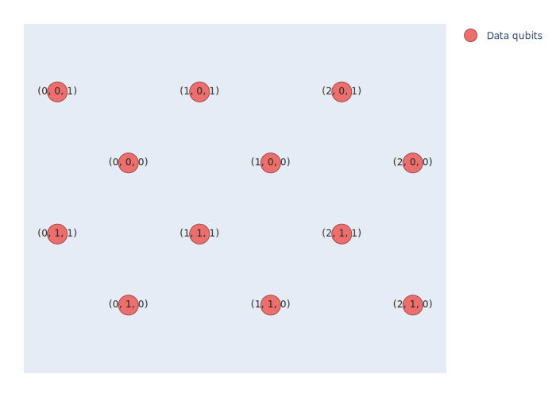
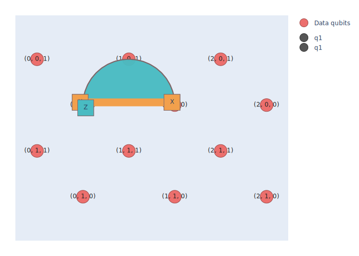
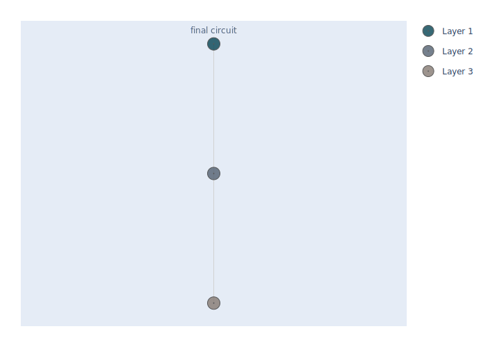

Visualize stabilizers and circuits
====================================

Loom provides a visualization tool to help you understand the stabilizers and circuits 
for your quantum error correction code. The tool can be accessed via the 
:mod:`~loom.visualizer` package.

.. code-block:: python

    import loom.visualizer as vis

StabilizerPlot Visualizer
-----------------------------

The :class:`~loom.visualizer.stabilizer_visualizer.StabilizerPlot` class is designed to 
visualize stabilizers and logical operators by plotting them on a grid of qubits. This 
allows users to easily analyze the structure of their quantum error correction code.

After importing the :mod:`~loom.visualizer` package, you can create a 
:class:`~loom.visualizer.stabilizer_visualizer.StabilizerPlot` instance using a 
:class:`~loom.eka.lattice.Lattice` object. The :class:`~loom.eka.lattice.Lattice` will 
form the grid on which data qubits will be plotted and can be visualized using the 
:func:`~loom.visualizer.stabilizer_visualizer.StabilizerPlot.add_dqubit_traces` method.

.. code-block:: python

    from loom.eka import Lattice

    # Create a StabilizerPlot instance using a square lattice and add data qubit traces
    stab_plot = vis.StabilizerPlot(lattice := Lattice.square_2d((3, 2)))
    stab_plot.add_dqubit_traces()

    # Show the plot
    stab_plot.show()

:class:`~loom.eka.block.Block` can then be plotted on top of the grid using the 
:meth:`~loom.visualizer.stabilizer_visualizer.StabilizerPlot.plot_blocks` method. A 
:class:`~loom.eka.block.Block` is a collection of stabilizers and logical operators that 
represent a part of your quantum error correction code.
    
.. code-block:: python

    from loom.eka import Block, Stabilizer, PauliOperator

    # Plot the stabilizers for a given Block
    stab_plot.plot_blocks(
        block := Block(
            stabilizers=(Stabilizer("ZZ", ((0, 0, 0), (1, 0, 0))),),
            logical_x_operators=(PauliOperator("XX", ((0, 0, 0), (1, 0, 0))),),
            logical_z_operators=(PauliOperator("Z", ((0, 0, 0),)),),
            unique_label="q1",
        )
    )

    # Show the plot
    stab_plot.show()

For more details on how to use the 
:class:`~loom.visualizer.stabilizer_visualizer.StabilizerPlot` class, refer to the 
:doc:`Visualizer Stabilizer Plot </../../notebooks/visualizer_stabilizerplot>` tutorial.

Circuit Visualizer
----------------------

Alternatively, you can also visualize your :class:`~loom.eka.circuit.Circuit` using the 
:meth:`~loom.visualizer.circuit_visualizer.plot_circuit_tree` method. This method 
displays the circuit into a nested tree, allowing users to easily analyze the structure 
of their error correcting circuits.

.. code-block:: python

    from loom.eka import Eka
    from loom.eka.operations import ResetAllDataQubits
    from loom.interpreter import interpret_eka

    my_eka = Eka(
    lattice=lattice,
    blocks=[block],
    operations=[ResetAllDataQubits("q1", state="0")],
    )

    interpreted = interpret_eka(my_eka)
    vis.plot_circuit_tree(interpreted.final_circuit)

For more details on how to use the 
:meth:`~loom.visualizer.circuit_visualizer.plot_circuit_tree` method, refer to the 
:doc:`Visualizer Circuit </../../notebooks/visualizer_circuit>` tutorial.
