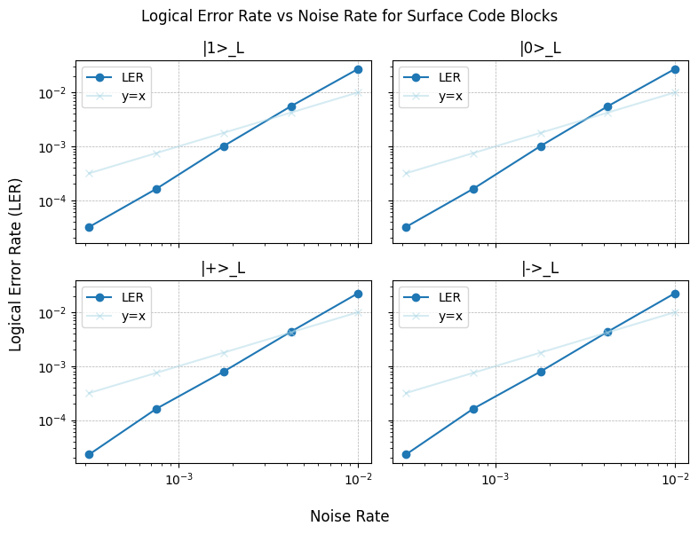

Rotated Surface Code Examples
==============================
Simple noiseless memory experiment
-----------------------------------
We provide a simple example of a noiseless memory experiment using a distance-3 rotated surface code. 
The experiment initializes the logical qubit in different states, performs syndrome measurements, and finally measures the logical qubit.
The final circuits are then simulated using Stim to validate that the logical qubit behaves as expected.

.. code-block:: python

    # Initialize block
    rsc_block_1 = RotatedSurfaceCode.create(3, 3, lattice, unique_label="rsc_block_1")

    states_list = ["1", "0", "+", "-"]
    logicals_names = ["Z_L", "Z_L", "X_L", "X_L"]

    # Create four circuits, each with a different logical state initialized
    interpreted_circ_list = []
    for state in states_list:
        operations = (
            (   # Encode pt1: Reset all data qubits
                ResetAllDataQubits(rsc_block_1.unique_label, state=state),
            ),
            (   # Encode pt2: Encode data qubits via measurements
                MeasureBlockSyndromes(rsc_block_1.unique_label, n_cycles=1),
            ),
            (   # Syndromes: Information collection
                MeasureBlockSyndromes(rsc_block_1.unique_label, n_cycles=2),
            ),
            (   # Measure logicals
                MeasureLogicalZ(rsc_block_1.unique_label) if state in ["0", "1"] else MeasureLogicalX(rsc_block_1.unique_label),
            ),
        )

        eka_obj = Eka(lattice, blocks=[rsc_block_1], operations=operations)
        interpreted = interpret_eka(eka_obj)

        interpreted_circ_list.append(interpreted)

    from loom.executor import EkaCircuitToStimConverter
    import numpy as np

    # STIM settings
    stim_nsamples = 1000

    converter = EkaCircuitToStimConverter()
    for index, interpreted in enumerate(interpreted_circ_list):
        # Convert interpreted Eka circuit to Stim circuit
        stim_circ = converter.convert(interpreted)

        # Sample the Stim circuit
        sampler = stim_circ.compile_sampler()
        samples = sampler.sample(shots=stim_nsamples)

        # Get logical counts
        output = {}
        for stim_obs in range(1, stim_circ.num_observables + 1):
            obs_instr = stim_circ[-stim_obs]
            meas_indices = [rec.value for rec in obs_instr.targets_copy()]
            obs_samples = np.bitwise_xor.reduce(samples[:, meas_indices], axis=1)

            # Get counts
            unique_el, counts = np.unique(obs_samples, return_counts=True)
            output[stim_obs] = {"0": 0, "1": 0}

            for i in range(len(unique_el)):
                output[stim_obs][str(int(unique_el[i]))] = counts[i].item()

        # Print output for each circuit
        for key, value in output.items():
            print(f"Circuit{index + 1} {logicals_names[index]}: {value}")

        # Get detector flips
        det_samples_list = []
        for stim_det in range(1, stim_circ.num_detectors + 1):
            det_instr = stim_circ[-stim_det - stim_circ.num_observables]
            meas_indices = [rec.value for rec in det_instr.targets_copy()]
            det_samples = np.bitwise_xor.reduce(samples[:, meas_indices], axis=1)
            
            det_samples_list.append(sum(det_samples))

        # Print unique detector flips
        print("Detector flips: ", sum(det_samples_list))
        print()

    ## Expected output:
    # Circuit1 Z_L: {'0': 0, '1': 1000}
    # Detector flips:  0
    #
    # Circuit2 Z_L: {'0': 1000, '1': 0}
    # Detector flips:  0
    #
    # Circuit3 X_L: {'0': 1000, '1': 0}
    # Detector flips:  0
    #
    # Circuit4 X_L: {'0': 0, '1': 1000}
    # Detector flips:  0

Simple noisy memory experiment
-----------------------------------
We adapt the Eka circuit from the previous section to provide an example of a noisy memory experiment. 
We will apply varying levels of noise to the circuit using Stim to validate that the logical qubit is able to correct errors up to its threshold.
We will use the PyMatching package to decode the detector outcomes, and use MatPlotLib to plot the logical error rate as a function of physical error rate.

.. code-block:: python

    from loom.executor import noise_annotated_stim_circuit
    import pymatching as pym
        
    stim_nsamples = 1_000_000
    noise_rates = [10**(i) for i in np.linspace(-3.5, -2, 5)]

    converter = EkaCircuitToStimConverter()

    circuit_lers_list = [[], [], [], []]
    for cir_index, interpreted in enumerate(interpreted_circ_list):
        stim_circ = converter.convert(interpreted, with_ticks=True)

        for noise in noise_rates:
            stim_circ_noise = noise_annotated_stim_circuit(stim_circ, after_clifford_depolarization=noise)
            
            # Create detector error model and matching graph
            dem = stim_circ_noise.detector_error_model(decompose_errors=True)
            matching_graph = pym.Matching.from_detector_error_model(dem)
            
            # Sample the Stim circuit 
            det_sampler = stim_circ_noise.compile_detector_sampler()
            samples, actual_log = det_sampler.sample(shots=stim_nsamples, separate_observables=True)
            predicted_log = matching_graph.decode_batch(samples)
            
            ler_stim = sum(pred != act for pred, act in zip(predicted_log, actual_log)) / len(
                actual_log
            )
            circuit_lers_list[cir_index].append(ler_stim)
            
    ## Plot results using MatPlotLib
    import matplotlib.pyplot as plt

    fig, ax = plt.subplots(nrows=2, ncols=2, sharex=True, sharey=True, figsize=(8, 6))
    fig.suptitle("Logical Error Rate vs Noise Rate for Surface Code Blocks")
    fig.supxlabel("Noise Rate")
    fig.supylabel("Logical Error Rate (LER)")

    for i, row in enumerate(ax):
        for j, col in enumerate(row):
            col.plot(
                noise_rates, 
                circuit_lers_list[i], 
                marker="o", 
                linestyle="-", 
                label="LER",
            )
            col.plot(
            noise_rates,
            noise_rates,
            marker="x",
            linestyle="-",
            label="y=x",
            color="lightblue",
            alpha=0.5,
            )

            col.set_title(f"|{states_list[2 * i + j]}>_L")

            col.set_xscale("log")
            col.set_yscale("log")

            col.grid(linestyle="--", linewidth=0.5)

            col.legend()

    fig.tight_layout()
    plt.show()

